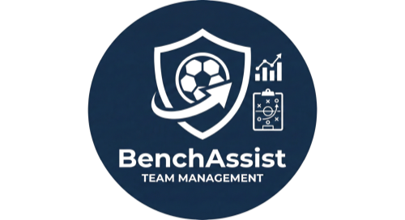
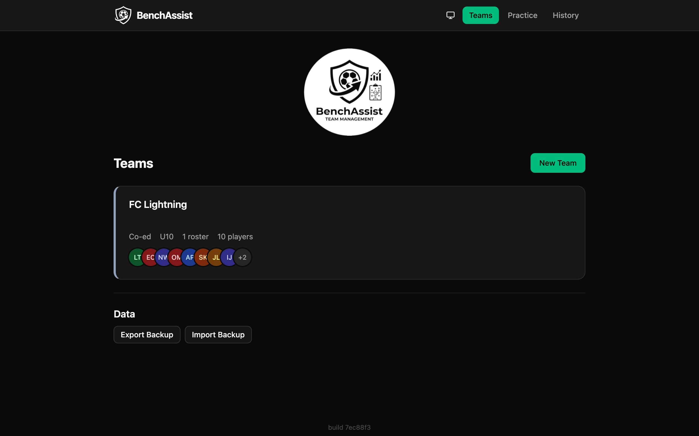
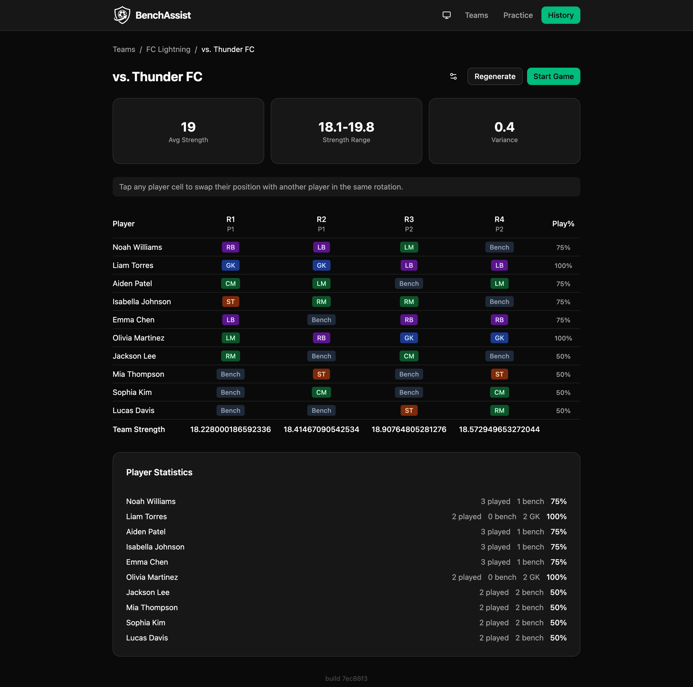
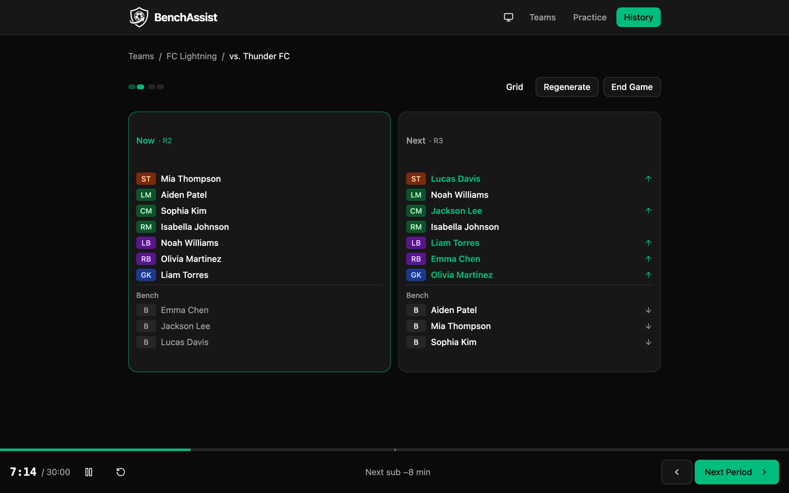
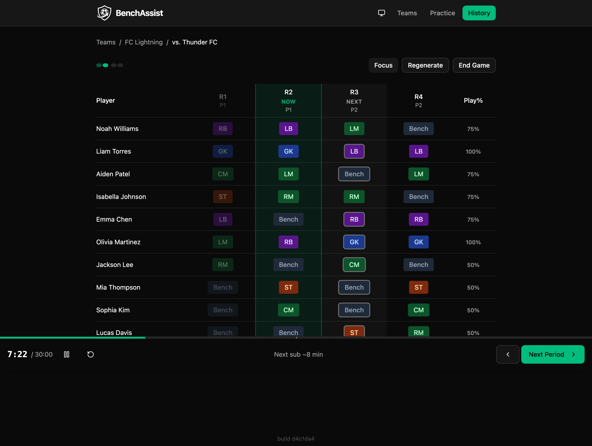
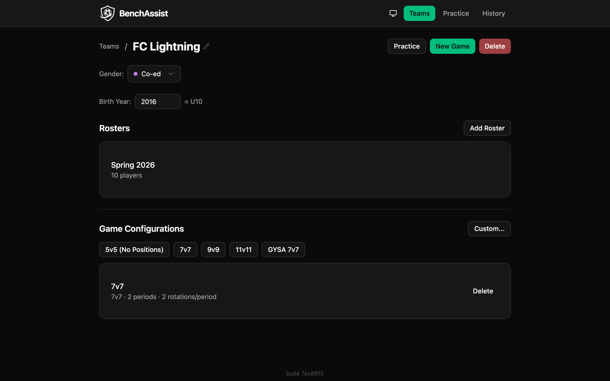
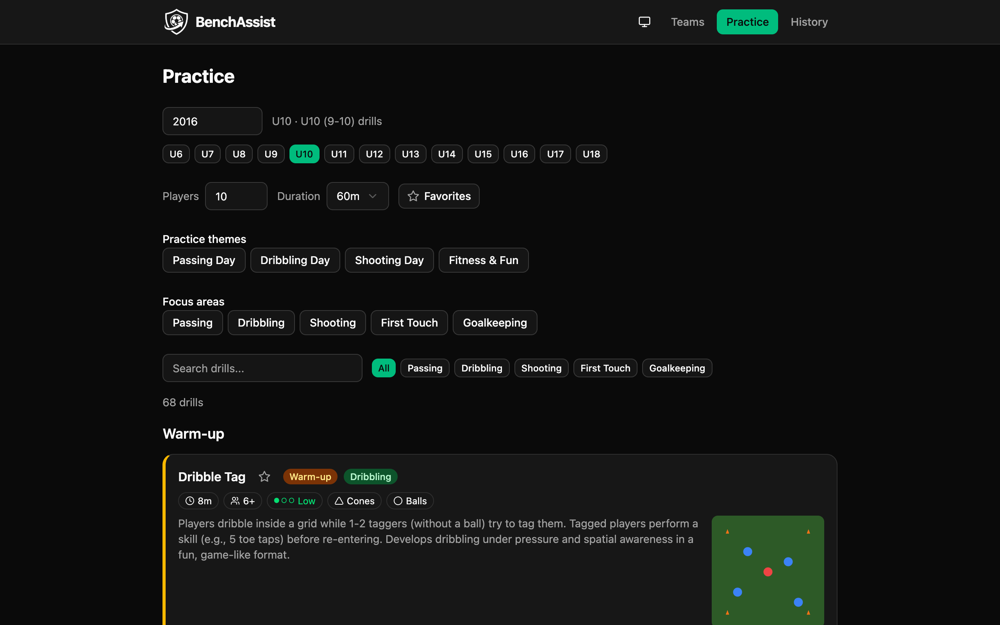

<p align="center">
  
</p>

<p align="center">
  <strong>Fair rotation schedules for youth soccer — no backend, no accounts, just open your browser.</strong>
</p>

<p align="center">
  <a href="https://matthewevans.github.io/benchassist/">Live App</a> ·
  <a href="#features">Features</a> ·
  <a href="#getting-started">Getting Started</a> ·
  <a href="#tech-stack">Tech Stack</a>
</p>

---

BenchAssist is a free, open-source Progressive Web App that helps youth soccer coaches create balanced player rotations. It runs entirely in the browser — all data stays on your device in localStorage. Install it on your phone and use it on the sideline, no internet required.

## Screenshots

| Dashboard                                    | Rotation Grid                                        |
| -------------------------------------------- | ---------------------------------------------------- |
|  |  |

| Live Focus View                                     | Live Grid View                                    |
| --------------------------------------------------- | ------------------------------------------------- |
|  |  |

| Team Management                                          | Practice Planner                                           |
| -------------------------------------------------------- | ---------------------------------------------------------- |
|  |  |

## Features

**Team & Roster Management** — Create teams, bulk-import players, track skill rankings (1–5), goalie eligibility, and preferred positions.

**Smart Rotation Solver** — An exhaustive search algorithm (running in a Web Worker so the UI stays smooth) generates optimal schedules that balance playing time across players while respecting constraints:

- No consecutive bench assignments
- Minimum play-time percentage
- Goalie rest between periods
- Skill-balance priority (strict / balanced / off)
- Manual overrides for specific rotations

**Position-Aware Scheduling** — 4 broad positions (GK, DEF, MID, FWD) map to 14 sub-positions. Players are auto-assigned to formation slots with a two-pass algorithm that respects primary and secondary position preferences.

**Live Game Mode** — Track the game in real time with period timers, audio substitution alerts, a Now/Next focus view, and the ability to add or remove players mid-game with automatic schedule re-solving.

**Practice Planner** — Browse ~100 curated drills, filtered by age bracket (U6–U18). Generate practice plans by category, duration, and player count. Favorite drills for quick access. Each drill includes a rendered field diagram.

**Data Portability** — Selective export/import (pick which teams, rosters, configs, and game history to include), full-data replacement, and schema migrations across versions. All destructive actions are undoable for 8 seconds via an undo toast.

**Preset Game Configs** — 5v5, 7v7, 9v9, 11v11, and GYSA 7v7 templates with customizable periods, rotation counts, and constraint rules.

## Getting Started

### Prerequisites

- [Node.js](https://nodejs.org/) 20+
- [pnpm](https://pnpm.io/) 9+

### Install & Run

```bash
git clone https://github.com/matthewevans/benchassist.git
cd benchassist
pnpm install
pnpm dev
```

Open [http://localhost:5173/benchassist/](http://localhost:5173/benchassist/) in your browser.

### Scripts

| Command          | Description                    |
| ---------------- | ------------------------------ |
| `pnpm dev`       | Start Vite dev server with HMR |
| `pnpm build`     | Type-check + production build  |
| `pnpm test`      | Run Vitest in watch mode       |
| `pnpm test:run`  | Run tests once (CI mode)       |
| `pnpm lint`      | Run ESLint                     |
| `pnpm format`    | Format all files with Prettier |
| `pnpm typecheck` | Type-check without emitting    |

## Tech Stack

| Layer     | Technology                                                         |
| --------- | ------------------------------------------------------------------ |
| Framework | React 19, TypeScript 5.9, Vite 7                                   |
| Styling   | Tailwind CSS v4, shadcn/ui (New York), Radix UI                    |
| State     | `useReducer` + Immer (single context, discriminated-union actions) |
| Routing   | React Router v7                                                    |
| Solver    | Web Worker with exhaustive search + pruning                        |
| Testing   | Vitest, Testing Library, fishery factories                         |
| PWA       | vite-plugin-pwa, auto-update, standalone display                   |
| Quality   | ESLint, Prettier, Husky + lint-staged                              |

## Project Structure

```
src/
├── components/        # React components
│   ├── ui/            #   shadcn/ui primitives
│   ├── game/          #   Game-specific components
│   └── layout/        #   App shell & navigation
├── context/           # AppContext (single reducer + Immer)
├── data/              # Drill library (~100 entries)
├── hooks/             # Custom hooks (solver, timer, undo, etc.)
├── pages/             # Route-level page components
├── storage/           # localStorage persistence & export/import
├── types/             # Domain model, solver messages, drill types
├── utils/             # Stats, validation, positions, practice generation
└── workers/           # Web Worker for rotation solver
```

## Architecture Overview

All app state flows through a single `useReducer` in `AppContext` with Immer for immutable updates. The reducer uses a discriminated union of 40+ action types with an exhaustive `never` check. State auto-persists to localStorage with a 500ms debounce.

The rotation solver runs in a Web Worker to keep the UI responsive. It uses exhaustive search with pruning — generating valid bench patterns per player, searching all combinations, and scoring by team-strength variance. Mid-game re-solves preserve existing rotations.

The undo system wraps the reducer with Immer's `produceWithPatches`, capturing inverse patches for destructive actions (delete, import, merge). A ref-based stack holds up to 30 undo entries.

## Contributing

Contributions are welcome! Please open an issue first to discuss what you'd like to change.

1. Fork the repo
2. Create a feature branch (`git checkout -b feature/my-change`)
3. Make your changes and add tests
4. Run `pnpm test:run && pnpm lint && pnpm build` to verify
5. Open a Pull Request

## License

[MIT](LICENSE) — Matt Evans
