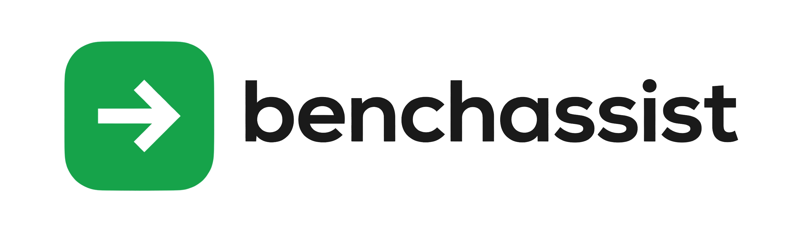
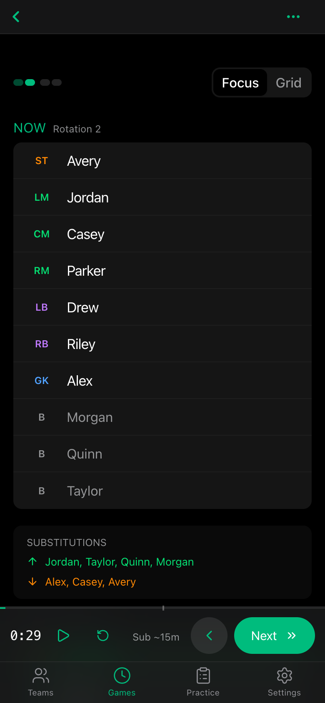
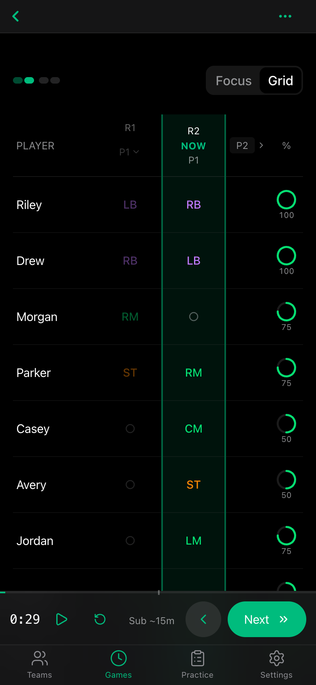
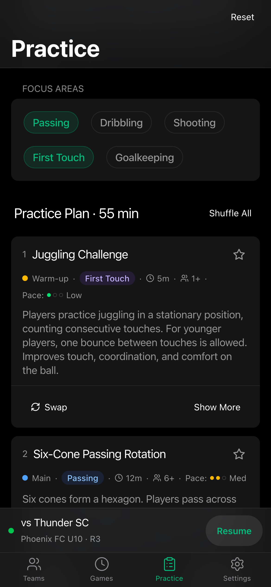
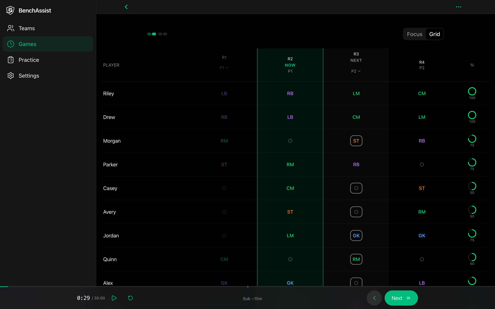
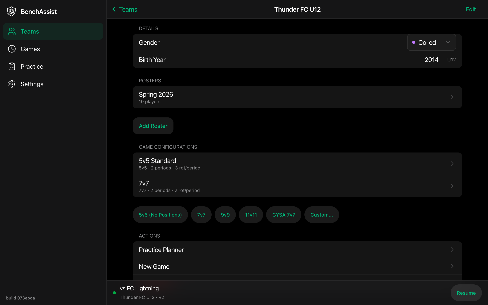

<p align="center">
  <picture>
    <source media="(prefers-color-scheme: dark)" srcset="public/benchassist-logo-wordmark-dark.png" />
    <source media="(prefers-color-scheme: light)" srcset="public/benchassist-logo-wordmark-light.png" />
    
  </picture>
</p>

<h1 align="center">BenchAssist</h1>

<p align="center">
  <strong>The sideline rotation manager for youth soccer coaches.</strong><br />
  A free, open-source PWA — no backend, no accounts, all data on your device.
</p>

<p align="center">
  <a href="https://benchassist.app/">Try the Live App</a> ·
  <a href="#features">Features</a> ·
  <a href="#screenshots">Screenshots</a> ·
  <a href="#getting-started">Getting Started</a>
</p>

---

> **Get BenchAssist** — Open the [live app](https://benchassist.app/) on your phone, tap **Share → Add to Home Screen**. No app store needed.

## Screenshots

<p align="center">
  
  &nbsp;&nbsp;
  
  &nbsp;&nbsp;
  
</p>

<p align="center">
  <em>Live game day — track rotations, plan practices, all from the sideline.</em>
</p>

|                        Rotation Grid                         |                         Team Management                          |
| :----------------------------------------------------------: | :--------------------------------------------------------------: |
|  |  |

## Features

**Smart Rotation Solver** — Generates balanced schedules in a Web Worker. Respects constraints: no consecutive bench, minimum play time, goalie rest, and skill-balance priority.

**Live Game Mode** — Period timers, audio substitution alerts, Now/Next focus view. Add or remove players mid-game with automatic re-solving.

**Position-Aware Scheduling** — 14 sub-positions across 4 position groups. Players auto-assign to formation slots based on their preferences.

**Practice Planner** — ~100 curated drills filtered by age bracket (U6–U18). Generate plans by category, duration, and player count.

**Team & Roster Management** — Bulk-import players, track skill rankings, goalie eligibility, and preferred positions.

**Data Portability** — Selective export/import, schema migrations, and 8-second undo on all destructive actions. All data stays on your device.

## Getting Started

### Prerequisites

- [Node.js](https://nodejs.org/) 20+
- [pnpm](https://pnpm.io/) 9+

### Install & Run

```bash
git clone https://github.com/matthewevans/benchassist.git
cd benchassist
pnpm install
pnpm dev
```

Open [localhost:5173](http://localhost:5173/) in your browser.

<details>
<summary><strong>All Commands</strong></summary>

| Command          | Description                    |
| ---------------- | ------------------------------ |
| `pnpm dev`       | Start Vite dev server with HMR |
| `pnpm build`     | Type-check + production build  |
| `pnpm test`      | Run Vitest in watch mode       |
| `pnpm test:run`  | Run tests once (CI mode)       |
| `pnpm lint`      | Run ESLint                     |
| `pnpm format`    | Format all files with Prettier |
| `pnpm typecheck` | Type-check without emitting    |

</details>

## Tech Stack

| Layer     | Technology                                                         |
| --------- | ------------------------------------------------------------------ |
| Framework | React 19, TypeScript 5.9, Vite 7                                   |
| Styling   | Tailwind CSS v4, shadcn/ui (New York), Radix UI                    |
| State     | `useReducer` + Immer (single context, discriminated-union actions) |
| Routing   | React Router v7                                                    |
| Solver    | Web Worker with exhaustive search + pruning                        |
| Testing   | Vitest, Testing Library, fishery factories                         |
| PWA       | vite-plugin-pwa, auto-update, standalone display                   |
| Quality   | ESLint, Prettier, Husky + lint-staged                              |

## Under the Hood

All app state flows through a single `useReducer` in `AppContext` with Immer for immutable updates. The reducer uses a discriminated union of 40+ action types with an exhaustive `never` check. State auto-persists to localStorage with a 500ms debounce.

The rotation solver runs in a Web Worker to keep the UI responsive. It uses exhaustive search with pruning — generating valid bench patterns per player, searching all combinations, and scoring by team-strength variance. Mid-game re-solves preserve existing rotations.

The undo system wraps the reducer with Immer's `produceWithPatches`, capturing inverse patches for destructive actions (delete, import, merge). A ref-based stack holds up to 30 undo entries.

<details>
<summary><strong>Project Structure</strong></summary>

```
src/
├── components/        # React components
│   ├── ui/            #   shadcn/ui primitives
│   ├── game/          #   Game-specific components
│   └── layout/        #   App shell & navigation
├── context/           # AppContext (single reducer + Immer)
├── data/              # Drill library (~100 entries)
├── hooks/             # Custom hooks (solver, timer, undo, etc.)
├── pages/             # Route-level page components
├── storage/           # localStorage persistence & export/import
├── types/             # Domain model, solver messages, drill types
├── utils/             # Stats, validation, positions, practice generation
└── workers/           # Web Worker for rotation solver
```

</details>

## Contributing

Contributions are welcome! Please open an issue first to discuss what you'd like to change.

1. Fork the repo
2. Create a feature branch (`git checkout -b feature/my-change`)
3. Make your changes and add tests
4. Run `pnpm test:run && pnpm lint && pnpm build` to verify
5. Open a Pull Request

## License

[MIT](LICENSE) — Matt Evans
